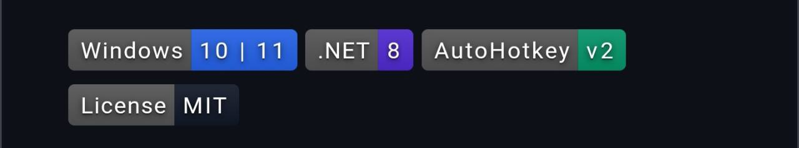

<!-- ARTEMIS-IGNIS-TOP:START -->

  

<!-- ARTEMIS-IGNIS-TOP:END -->

<!-- ARTEMIS-IGNIS-BADGE-BAR:START -->

  
  
  

<!-- ARTEMIS-IGNIS-BADGE-BAR:END -->

<a href="README.ko.md">한국어</a>

# Claude Builders Bounty 🤖

> A community bounty board for Claude Code builders.

Building with Claude Code? Have tasks to delegate?
Want to get paid for contributing to AI projects?
You're in the right place.

---

## How it works

**To post a bounty**
1. Open a GitHub issue with a clear description and acceptance criteria
2. Comment `/opire create $XXX` in the issue to set the reward
3. Share the link — contributors will find it

**To claim a bounty**
1. Browse the open issues below
2. Comment `/opire try` in the issue you want to work on
3. Submit a PR — payment is automatic on merge ✅

---

## Active Bounties

| # | Task | Amount | Status |
|---|------|--------|--------|
| [#1](../../issues/1) | SKILL: Generate a CHANGELOG from git history | $50 | 🟢 Open |
| [#2](../../issues/2) | TEMPLATE: CLAUDE.md for a Next.js + SQLite project | $75 | 🟢 Open |
| [#3](../../issues/3) | HOOK: Block destructive bash commands in Claude Code | $100 | 🟢 Open |
| [#4](../../issues/4) | AGENT: PR reviewer with structured Markdown output | $150 | 🟢 Open |
| [#5](../../issues/5) | WORKFLOW: n8n + Claude API — automated weekly dev summary | $200 | 🟢 Open |

---

## Rules

- Tasks must be related to Claude Code or AI tooling
- Every issue must have clear acceptance criteria before a bounty is activated
- Payment is handled by [Opire](https://opire.dev) (Stripe)
- Quality over speed — a solid PR beats a fast one

---

## Community

- 🐦 X: [@ClaudeBounty](https://x.com/ClaudeBounty)
- 📧 Contact: claudebounty@gmail.com

---

*Started by the Claude builder community · March 2026 · MIT License*

<!-- ARTEMIS-IGNIS-BADGES:START -->

  

<!-- ARTEMIS-IGNIS-BADGES:END -->

